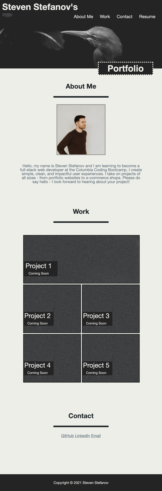

# Personal-Portfolio

## Project Description

This project is a one page personal portfolio. It is intended to showcase my personal work achievements and inform potential recruiters and employers of my technical skills.

## Project Screenshot  

 
## Link to Deployed Project  

https://stevenstefanov.github.io/Personal-Portfolio/

## Background

My goal at the end of this bootcamp is to get a position as a junior software developer. This project will help me set up the foundation for my portfolio. As the course progresses and my knowledge is expanding, I would like to build upon this portfolio and add my actual projects to be displayed there.

## Challenges

For me personally, the CSS flexbox code was the most difficult. Getting the different fields to arrange in a way where they look good in both desktop and mobile versions was pretty challenging.

## Learnings

Through this project, I got a lot more comfortable with CSS styling. I learned a lot about hover actions, positioning, color styling and much more.

## Usage

This is a single page website. There is a navigation menu on the top with four links. When either of the first three are pressed, each link will direct you to the corresponding area on the page related to that topic. The last link titles Resume will direct a user to a Google Drive document with my resume.

## Credits

Thank you to Columbia's Full-Stack Web Developer bootcamp for all the assistance and for teaching me all that I have learned.

## Licence

Copyright (c) 2021 Steven Stefanov

Permission is hereby granted, free of charge, to any person obtaining a copy
of this software and associated documentation files (the "Software"), to deal
in the Software without restriction, including without limitation the rights
to use, copy, modify, merge, publish, distribute, sublicense, and/or sell
copies of the Software, and to permit persons to whom the Software is
furnished to do so, subject to the following conditions:

The above copyright notice and this permission notice shall be included in all
copies or substantial portions of the Software.

THE SOFTWARE IS PROVIDED "AS IS", WITHOUT WARRANTY OF ANY KIND, EXPRESS OR
IMPLIED, INCLUDING BUT NOT LIMITED TO THE WARRANTIES OF MERCHANTABILITY,
FITNESS FOR A PARTICULAR PURPOSE AND NONINFRINGEMENT. IN NO EVENT SHALL THE
AUTHORS OR COPYRIGHT HOLDERS BE LIABLE FOR ANY CLAIM, DAMAGES OR OTHER
LIABILITY, WHETHER IN AN ACTION OF CONTRACT, TORT OR OTHERWISE, ARISING FROM,
OUT OF OR IN CONNECTION WITH THE SOFTWARE OR THE USE OR OTHER DEALINGS IN THE
SOFTWARE.